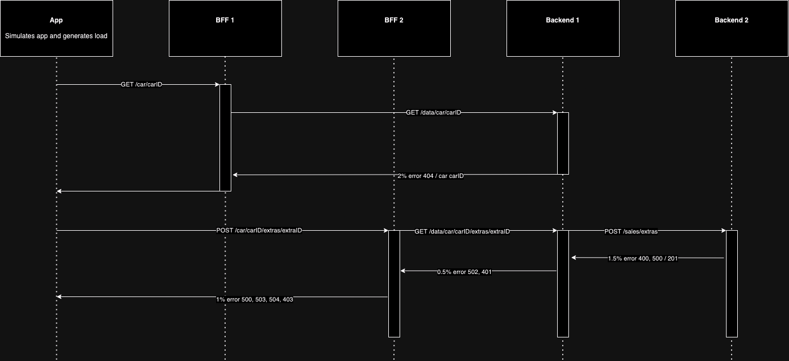

# Build and push
## Docker
1. Create Github [Personal Access Token](https://github.com/settings/tokens/new)
  - Give read/write/delete package permissions
2. Login to registry: `docker login ghcr.io -u YOUR_GITHUB_USERNAME -p YOUR_PERSONAL_ACCESS_TOKEN`
3. Build images:
```
docker buildx build --no-cache --platform=linux/arm64 --tag=ghcr.io/gjpin/demo-apps-load-app:54.0 ./load-app
docker buildx build --no-cache --platform=linux/arm64 --tag=ghcr.io/gjpin/demo-apps-bff1:54.0 ./bff1
docker buildx build --no-cache --platform=linux/arm64 --tag=ghcr.io/gjpin/demo-apps-bff2:54.0 ./bff2
docker buildx build --no-cache --platform=linux/arm64 --tag=ghcr.io/gjpin/demo-apps-backend1:54.0 ./backend1
docker buildx build --no-cache --platform=linux/arm64 --tag=ghcr.io/gjpin/demo-apps-backend2:54.0 ./backend2
```
**Note:** If you have issues during buildx run the following command to check if you have installed multi platform support for buildx:
```
docker run --privileged --rm tonistiigi/binfmt --install all
```
4. Push images:
```
docker push ghcr.io/gjpin/demo-apps-load-app:54.0
docker push ghcr.io/gjpin/demo-apps-bff1:54.0
docker push ghcr.io/gjpin/demo-apps-bff2:54.0
docker push ghcr.io/gjpin/demo-apps-backend1:54.0
docker push ghcr.io/gjpin/demo-apps-backend2:54.0
```

## Podman
1. Create Github [Personal Access Token](https://github.com/settings/tokens/new)
  - Give read/write/delete package permissions
2. Login to registry: `docker login ghcr.io -u YOUR_GITHUB_USERNAME -p YOUR_PERSONAL_ACCESS_TOKEN`
3. Build images:
```
podman build --no-cache --tag=ghcr.io/gjpin/demo-apps-load-app:54.0 ./load-app
podman build --no-cache --tag=ghcr.io/gjpin/demo-apps-bff1:54.0 ./bff1
podman build --no-cache --tag=ghcr.io/gjpin/demo-apps-bff2:54.0 ./bff2
podman build --no-cache --tag=ghcr.io/gjpin/demo-apps-backend1:54.0 ./backend1
podman build --no-cache --tag=ghcr.io/gjpin/demo-apps-backend2:54.0 ./backend2
```
4. Push images:
```
podman push ghcr.io/gjpin/demo-apps-load-app:54.0
podman push ghcr.io/gjpin/demo-apps-bff1:54.0
podman push ghcr.io/gjpin/demo-apps-bff2:54.0
podman push ghcr.io/gjpin/demo-apps-backend1:54.0
podman push ghcr.io/gjpin/demo-apps-backend2:54.0
```

# Microservices



## App
- Creates traceparent header with [this library](https://www.npmjs.com/package/traceparent)
- javascript client with axios that makes the following:
  - makes GET requests constantly, with a delay between 0.2ms and 1.5s, to bff1/car/carID, where carID is a randomly generated integer between 1 and 1000000
  - makes POST requests constantly, with a delay between 0.2ms and 1.5s, to bff2/car/carID/extras/extraID, where carID and extraID are randomly generated integer between 1 and 1000000
  - all requests it makes have a header named 'Traceparent' with contents generated with https://www.npmjs.com/package/traceparent

## BFF 1
- bff1.apps-demo
- nodejs server that receives GET requests at /car/carID, where carID is an integer value
  - when it receives the requests, it makes a new GET request to backend1 at GET /data/car/carID
  - it receives the response from backend1 and forwards the response
- it forwards the traceparent header it receives from the client and forwards it in its requests

## BFF 2
- bff2.apps-demo
- nodejs server that receives POST requests at /car/carID/extras/extraID, where carID and extraID are integer values
  - when it receives the requests, it makes a new GET request to backend1 at GET /data/car/carID/extras/extraID
  - 1% of the time it returns a 500 or 503 or 504 or 403 error
  - otherwise, it returns the response from backend1 and forwards the response
- it forwards the traceparent header it receives from the client and forwards it in its requests

## Backend 1
- backend1.apps-demo
- nodejs server that receives GET requests at /data/car/carID and /data/car/carID/extras/extraID, where carID and extraID are integer values
  - for endpoint /data/car/carID, return a 404 error 2% of the time. otherwise, return a string "your car ID has full battery"
  - for endpoint /data/car/carID/extras/extraID, return a 502 or 401 0.5% of the time. otherwise, make a POST to /sales/extra on backend2
- it forwards the traceparent header it receives from the client and forwards it in its requests

## Backend 2
- backend2.apps-demo
- nodejs server that receives POST requests at /sales/extras
  - 1.5% of the time it returns a 400 or 500 error. otherwise, return return 201